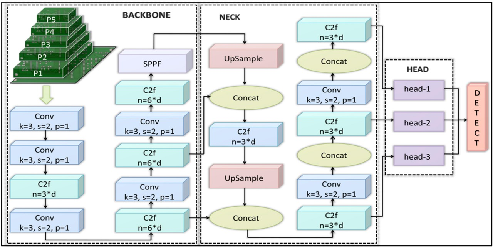

# Automated Printed Circuit Board Inspection: Incorporating YOLOv8 for Efficient Defect Detection

## Authors
- Gunti Swathi
- Rohan Reddy B
- Ashish Reddy M
- Prasanna Kumar

---

## Table of Contents
1. [Introduction](#introduction)
2. [Motivation](#motivation)
3. [Problem Statement](#problem-statement)
4. [Dataset](#dataset)
5. [Related Works](#related-works)
6. [Algorithmic Components](#algorithmic-components)
7. [Methodology](#methodology)
8. [Results](#results)
9. [Future Works](#future-works)
10. [References](#references)

---

## Introduction
- This repository contains the code and resources for our research on automated printed circuit board (PCB) inspection using the YOLOv8 algorithm.
- This study demonstrates how YOLOv8 can be employed to detect and classify defects in PCBs with high accuracy and efficiency.

## Motivation
The ever-expanding electronics industry relies heavily on the flawless performance of PCBs across a spectrum of applications. Even minor defects can lead to significant issues, impacting functionality and reliability. Traditional manual inspection methods are time-consuming, error-prone, and inconsistent. Our research aims to automate the defect detection process using advanced deep learning techniques.

## Problem Statement
- Precise detection and localization of small defects in PCBs pose significant challenges.
- Manual inspection is not only slow but also prone to errors.
- Our solution leverages the cutting-edge YOLOv8 algorithm, which excels in detecting even minute defects, enhancing both accuracy and efficiency in PCB defect detection.

## Dataset

The PCB Defect Dataset comprises:
- **Images**: 693 annotated images with a resolution of 640 x 640 pixels.
- **Defects**: 2953 distinct defects classified into six types:
  - Open Circuit
  - Short
  - Spur
  - Missing Hole
  - Spurious Copper
  - Mouse Bite

## Related Works
Several methods have been proposed for PCB defect detection:
1. **Subtraction Algorithm** - Pal et al. (2011)
2. **Hybrid Algorithm** - Chaudhary et al. (2017)
3. **Faster R-CNN with ResNet101 and ROI-Align** - Xie et al. (2022)
4. **Single Shot Detector and Feature Pyramid Network** - Wu et al. (2021)
5. **EfficientNet-B1 and K-means clustering for anchor ratio** - Jin et al. (2021)

## Algorithmic Components
The YOLOv8 architecture comprises:

- **Backbone**:utilizes a modified Cross-spatial Partial Darknet53 backbone, incorporating a lightweight 2 Convolutional module with n BottleNeck (C2f module). This modification enhances feature extraction by combining the C3 module with ELAN, improving gradient flow within the network.
- **Neck**: connects the Backbone and Head, playing a vital role in feature integration. It incorporates the PAN and FPN to establish connections at different levels, preventing information loss during feature processing.
- **Head**: with three separate detection components, operates independently for classification and regression. The decoupled structure eliminates the need for anchors, directly predicting object center coordinates and bounding box offsets. This simplification contributes to accurate object localization and identification.

## Methodology

- **Preprocessing**: The dataset undergoes a preprocessing, involving resizing to 640 x 640 pixels, normalization and data augmentation techniques such as Random Brightness, Random Crop, Rotate, RGB Shift, and Random Contrast.
- **Model Training**: YOLOv8s, the small version of YOLOv8 with pretrained weights, is selected after rigorous experimentation. The model is meticulously trained for 100 epochs on the augmented training set, considering the dataset's sample size and ensuring effective convergence during the training phase.

## Training

## Results
The proposed model achieved an impressive mAP score of 92.1, outperforming YOLOv7 by 12%. This highlights the effectiveness of YOLOv8 in object detection, providing superior accuracy without compromising detection speed.

## Sample Predictions

## Future Works
Future research directions include:
- Obtaining larger and more diverse datasets.
- Developing methods to handle imbalanced class distributions.
- Incorporating defect segmentation techniques for more detailed analysis.
- Ensuring model applicability in real-time industrial scenarios.

## References
1. Pal, A., Chauhan, S., & Bhardwaj, S. (2011). Detection of bare PCB defects by image subtraction method using machine vision. Proceedings of the World Congress on Engineering, 2.
2. Chaudhary, V., Dave, I. R., & Upla, K. P. (2017). Automatic visual inspection of printed circuit board for defect detection and classification. pp. 732–737.
3. Wu, X., Ge, Y., Zhang, Q., & Zhang, D. (2021). PCB defect detection using deep learning methods. pp. 873–876.
4. Xie, Y., Dong, Y., & He, H. (2022). Defect detection of printed circuit board based on small target recognition network. pp. 1–5.
5. Jin, J., Feng, W., Lei, Q., Gui, G., Li, X., Deng, Z., & Wang, W. (2021). Defect detection of printed circuit boards using EfficientDet. pp. 287–293.
6. Huang, W., & Wei, P. (2019). A PCB dataset for defects detection and classification.

---

Thank you for your interest in our research.
